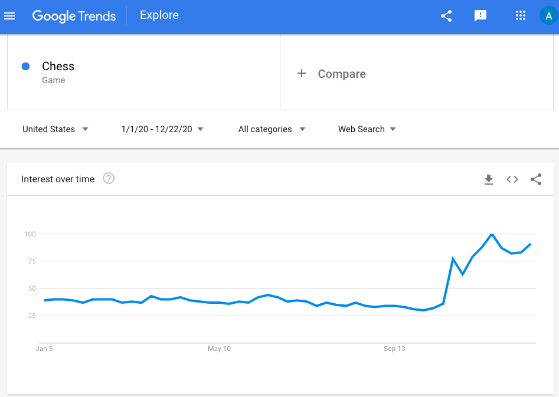

```{r setup, include=FALSE}
knitr::opts_chunk$set(echo = TRUE)
```

## Executive Overview

_The Queen's Gambit_, released in October 2020, has become Netflix's [most popular scripted limited series ever](https://techcrunch.com/2020/11/23/queens-gambit-viewership/).  Data from [Google Trends](https://trends.google.com/trends/explore?date=2020-01-01%202020-12-22&geo=US&q=%2Fm%2F01lb5) shows that interest in Chess has risen sharply since the release. 

```{r chess trend, echo=FALSE, out.width="80%", fig.align='center'}

```

In the series, Elizabeth Harmon is a chess prodigy, with a seemingly natural ability for the game.  But how important is skill/ability in the game of chess, and to what degree do factors like the length of the game (# of turns) and type of opening affect the outcome of the match?

This report details an approach to predicting the outcome of chess matches with machine learning. A dataset of approximately 20,000 chess games, is used to train a variety of machine learning models. An ensemble is then constructed to predict outcomes for a validation set, and assess the accuracy of the approach.

#### Datset Details
The dataset **[Chess Game Dataset (Lichess)](https://www.kaggle.com/datasnaek/chess)** is available on [Kaggle](https:://www.kaggle.com), built on data from [Lichess.org](http://lichess.org).  The dataset includes several interesting dimensions including the rating for both players - this rating is an estimation of the player's skill/ability (and experience).  The dataset also includes information on the type of game (Rated vs. Casual), the length of the game (in turns), and the type of opening played.

#### Validation / Goal
A subset of games (~10%) will be held back for validation of the final algorithm performance. Performance will be evaluated by comparing the accuracy of the algorithm to a totally naive approach (random guessing).

#### Approach
* Train/tune various machine learning models with a subset of the data (_training set_)
* Build an ensemble (majority vote)
* Compare the final accuracy of the ensemble vs. the accuracy of random guessing to assess the improvement resulting from machine learning.

***

## Analysis

### Data Preparation

First, the dataset will be downloaded and prepared for analysis.  The last row in the dataset is not complete, so it is removed.  Some of the dimensions are changed to factors.  Metadata columns including the username of the players, and the start/end time of the matches are removed, as they will not be used in this analysis.

```{r download and prep data for exploration, datawarning=FALSE, message=FALSE, warning=FALSE}

# Install required packages

if(!require(tidyverse)) install.packages("tidyverse", 
                                         repos = "http://cran.us.r-project.org")
if(!require(caret)) install.packages("caret", 
                                     repos = "http://cran.us.r-project.org")
if(!require(data.table)) install.packages("data.table", 
                                          repos = "http://cran.us.r-project.org")
if(!require(rpart)) install.packages("rpart", 
                                     repos = "http://cran.us.r-project.org")
if(!require(gridExtra)) install.packages("gridExtra", 
                                         repos = "http://cran.us.r-project.org")

# 3 significant digits
options(digits = 3)

dl = tempfile()

unzip("games.csv.zip", "games.csv", overwrite = TRUE)

data_raw <- read_csv("games.csv")

# The last row has a parsing problem
data_raw <- data_raw[1:20022,]

# filter out some of the unnecessary columns
data <- data_raw %>% mutate(winner = factor(winner), 
                        victory_status = factor(victory_status),
                        opening_eco = factor(opening_eco)) %>%
                 select(rated, turns, victory_status, winner, white_rating, 
                       black_rating, opening_eco, opening_name, 
                       opening_ply, increment_code)

```

### Data Exploration

##### Winner
There are 3 possible outcomes in a Chess game: 1) white wins; 2) black wins; or 3) a draw.  The tables below shows how likely each of these outcomes is within the data. 

```{r outcome table, echo=FALSE}
# How likely is each outcome?
table(data$winner)
data %>% group_by(winner) %>%
  summarize(win_pct = n()/nrow(data))
```

Note that white wins 49.9% of the time in the dataset (and does not win 50.1% of the time).

##### Turns
The average length of a game in the dataset is 60.5 turns, but the range of turns in a game varies, as shown in the histogram below.

```{r average turns}
mean(data$turns)
```

```{r turns histogram, warning=FALSE, message=FALSE, out.width="80%", fig.align='center'}
data %>% ggplot(aes(turns)) + geom_histogram()
```

The code below produces a plot that shows the win percentage for the white player based on the number of turns.

```{r wins by turns, out.width="80%", fig.align='center'}
data %>% group_by(turns) %>% summarize(white_win_pct = mean(winner == "white"), 
                                       n= n()) %>%
  ggplot(aes(turns, white_win_pct)) + geom_point() +
  ylab("white win pct")
```

This graph is showing a very high win percentage for the white player on odd numbered turns, and a very low win  percentage on even numbered turns.  In chess, the white player always moves first and the black player always moves second.  A player can only win a game by checkmate immediately after they have made their move (a game can also end by stalemate, draw or expiration of time).  The alternating high/low win percentage for the white player in this graph ssuggests that the dataset is counting each individual move as a "turn", hence why the white player is so much more likely to win after their move, and more likely to lose after the black player moves - especially in the beginning.  As turns continue, there is more likelihood for a draw or expiration of time, so the effect decreases slightly.  

In chess, it's more common to count the turns by __pairs__ of moves - one from each player (similar to an inning in baseball).  This is also a more useful metric when seeking to understand the effect of the length of a game (in # of turns) on the outcome.  The code below creates a new metric called "turn pairs" and shows the relationship between the number of turns and how likely the white player is to win.

```{r turn pair metric, warning=FALSE, message=FALSE, out.width="80%", fig.align='center'}
data %>% mutate(turn_pair = ceiling(turns/2)) %>%
  group_by(turn_pair) %>%
  summarize(white_win_pct = mean(winner == "white"), n = n()) %>%
  filter(n >= 50) %>%
  ggplot(aes(turn_pair, white_win_pct)) + geom_point() + geom_smooth() + 
  xlab("Turn pair") + ylab("White win pct")
```

The data shows that the White player does seem to win more often in games with less turns.

##### Timekeeping
Many chess games are played with a timer.  The dataset includes a column for the length of time each player had in the game.  This is commonly recorded in a format like this: 10+5.  This would indicate that each player had a total of 10 minutes, _plus_ 5 seconds each turn to account for delays (for humans this is reaction time and for online games it can help compensate for servers latency).  The code below looks at the relationship between the first part in the time increment, and the win percentage for the white player for time increments with at least 100 occurances.

```{r wins by time increment, out.width="80%", fig.align='center'}
game_length_time <- data$increment_code %>% strsplit(split="\\+")
temp <- sapply(game_length_time, head, 1)

# plotting the white win pct for time increments with at least 100 occurances
data %>% mutate(length = temp) %>% group_by(length) %>%
  mutate(white_win_pct = mean(winner == "white"), n = n()) %>%
  filter(n >= 100) %>% 
  ggplot(aes(x = reorder(length, as.numeric(length)), white_win_pct)) + geom_point() +
  xlab("Length (minutes)") + ylab("White win pct")
```

There doesn't seem to be a very strong or consistent relationship between the length of time the players start with, and who is more likely to win the match.

##### Rating (Skill/Ability)
The dataset includes the rating for the white player and the black player.  The maximum rating is 2700.

```{r max rating}
max(data$white_rating)
```

The mean ratings for white and black are both just under 1600.
```{r mean ratings}
# The mean rating for each color
mean(data$white_rating)
mean(data$black_rating)
```

The data shows that the mean rating for the white player is slightly higher.  As was seen before, white also has a slightly higher win percentage than black.  It could be that players with more experience know to select white more often.

There are rated game and casual games in the dataset.  A boolean variable distinguishes these.  The chart below shows the distribution of ratings for rated and casual games.

```{r rating histograms, warning=FALSE, message=FALSE, out.width="80%", fig.align='center'}
# Histogram of white rating in RATED games
rated <- data %>% filter(rated == "TRUE") %>% ggplot(aes(white_rating)) + 
  geom_histogram() + ggtitle("Rated")
# Histogram of white rating in CASUAL (non-rated) games
casual <- data %>% filter(rated == "FALSE") %>% ggplot(aes(white_rating)) + 
  geom_histogram() + ggtitle("Casual")
# Notice: There is a big spike around 1500.  This may be a default or initial rating
library(gridExtra)
grid.arrange(rated, casual, nrow = 1)
```

The graph shows that that there is a big spike around 1500 - this could be a default or initial rating for unrated players.

The difference between the rating of the two players could be an important factor in the outcome of the game.  The code below calculates this difference and shows a histogram of the delta between the white player and the black player.

```{r rating delta, message=FALSE, out.width="80%", fig.align='center'}
# Create a variable (rating_delta) that is the difference between white and black rating
# and makes a histogram
data %>% mutate(rating_delta = white_rating - black_rating) %>% 
  ggplot(aes(rating_delta)) + geom_histogram()
```

Players are pretty evenly matched in many games, but sometimes there is a big difference - up to +/- 1000 points.

The table below shows the difference in the mean and the distribution of the rating delta for all games, rated games, and casual games.

```{r rating delta stats in rated vs casual games, message=FALSE, warning=FALSE}
# Descriptive stats about rating delta
all_games <- data %>% mutate(rating_delta = white_rating - black_rating) %>% 
  summarize(average_rating_delta = mean(rating_delta),
            sd_rating_delta = sd(rating_delta))

# Add to a table
rating_delta_table <- data.frame(type = "All games", 
                                 average = all_games$average_rating_delta, 
                                 sd = all_games$sd_rating_delta)

# Rating delta in RATED games only
rated_games <- data %>% filter(rated == TRUE) %>% 
  mutate(rating_delta = white_rating - black_rating) %>% 
  summarize(average_rating_delta = mean(rating_delta),
            sd_rating_delta = sd(rating_delta))

rating_delta_table <- bind_rows(rating_delta_table, 
                                data.frame(type = "Rated Games", 
                                           average = rated_games$average_rating_delta, 
                                           sd = rated_games$sd_rating_delta))

# ratings delta in CASUAL (non-rated) games only
casual_games <- data %>% filter(rated == FALSE) %>% 
  mutate(rating_delta = white_rating - black_rating) %>% 
  summarize(average_rating_delta = mean(rating_delta),
            sd_rating_delta = sd(rating_delta))

rating_delta_table <- bind_rows(rating_delta_table, 
                                data.frame(type = "Casual Games", 
                                           average = casual_games$average_rating_delta, 
                                           sd = casual_games$sd_rating_delta))

# output the table
rating_delta_table %>% knitr::kable()
```

Based on the mean and the standard distribution, rated games are more likely to have evenly matched players, whereas the ratings difference between players is slightly larger in casual games.

The code below shows the win percentage for white based on the ratings delta for all games, rated games, and casual games.

```{r wins by rating delta for rated and casual games, out.width="80%", fig.align='center'}
# Plotting the win rate for white by rating delta
wins_by_rating_delta_all <- data %>% 
  mutate(rating_delta = white_rating - black_rating) %>%
  filter(rating_delta >= -1000 & rating_delta <= 1000) %>%
  mutate(rating_delta_group = cut(rating_delta, seq(-1000, 1000, 25), 
                                  ordered_result = TRUE)) %>%
  group_by(rating_delta_group) %>% 
  summarize(n = n(), white_win_pct = mean(winner == "white")) %>%
  ggplot(aes(rating_delta_group, white_win_pct)) + 
  scale_x_discrete(guide = guide_axis(check.overlap = TRUE)) + 
  geom_point() + ggtitle("All Games") + xlab("Rating Group") + 
  ylab("white win pct")

# Plotting the win rate for White by rating delta for RATED games only
wins_by_rating_delta_rated <- data %>% 
  mutate(rating_delta = white_rating - black_rating) %>%
  filter(rating_delta >= -1000 & rating_delta <= 1000 & rated == "TRUE") %>%
  mutate(rating_delta_group = cut(rating_delta, seq(-1000, 1000, 25), 
                                  ordered_result = TRUE)) %>% 
  group_by(rating_delta_group) %>% 
  summarize(n = n(), white_win_pct = mean(winner == "white")) %>%
  ggplot(aes(rating_delta_group, white_win_pct)) + 
  scale_x_discrete(guide = guide_axis(check.overlap = TRUE)) + 
  geom_point() + ggtitle("Rated Games") + xlab("Rating Group") + 
  ylab("white win pct")

# Plotting the win rate for White by rating delta for CASUAL (non-rated) games only
wins_by_rating_delta_casual <- data %>% 
  mutate(rating_delta = white_rating - black_rating) %>%
  filter(rating_delta >= -1000 & rating_delta <= 1000 & rated == "FALSE") %>%
  mutate(rating_delta_group = cut(rating_delta, seq(-1000, 1000, 25), 
                                  ordered_result = TRUE)) %>% 
  group_by(rating_delta_group) %>% 
  summarize(n = n(), white_win_pct = mean(winner == "white")) %>%
  ggplot(aes(rating_delta_group, white_win_pct)) + 
  scale_x_discrete(guide = guide_axis(check.overlap = TRUE)) + 
  geom_point() + ggtitle("Casual Games") + xlab("Rating Group") + 
  ylab("white win pct")

grid.arrange(wins_by_rating_delta_all, wins_by_rating_delta_rated, 
             wins_by_rating_delta_casual, 
             layout_matrix = rbind(c(1, 1),
                                   c(2, 3)),
             heights = c(1.5, 1),
             nrow = 2, ncol = 2)
```

Overall, there appears to be a definite relationship between the difference in the ratings of the two players, and the likelihood for the white player to win.  If the white player has a much higher rating than the black player, they are much more likely to win (and vice versa).  The data also shows that when the players are evenly matched, the likelihood of white winning the game is around 50%.  Looking at rated vs. casual games, this relationship seems very strong for rated games and a bit looser for casual games.

##### Opening
In Chess, there is a lot of focus on the opening phase of the game.  The Encyclopaedia of Chess Openings keeps a list of all chess openings and [categorizes them into 5 different variants](https://en.wikipedia.org/wiki/Encyclopaedia_of_Chess_Openings#Main_ECO_codes).

There are 5 major __types__ of openings.  The code and graph below shows the the win percentage for the white player based on the _type_ of opening played.

```{r wins by opening type, out.width="80%", fig.align='center'}
data %>% mutate(opening_type = factor(substr(opening_eco, 1, 1))) %>%
  group_by(opening_type) %>%
  summarize(white_win_pct = mean(winner == "white"), n = n()) %>%
  ggplot(aes(opening_type, white_win_pct)) + geom_point() + 
  xlab("Opening Type") + ylab("white win pct")
```

There doesn't seem to be a huge advantage/disadvantage from any type of opening, however individual openings do seem to result in different outcomes, as the code and graph below shows.  This code includes a filter to only display the results for common openings (used at least 100 times).

```{r wins by specific opening, out.width="80%", fig.align='center'}
data %>% group_by(opening_name) %>% 
  summarize(n = n(), average = mean(winner == "white")) %>%
  filter(n >= 100) %>% arrange(desc(average)) %>%
  ggplot(aes(x = reorder(opening_name, -average), y = average)) + 
  scale_x_discrete(guide = guide_axis(check.overlap = TRUE)) +
  geom_point() + ylab("white win pct") + xlab("opening name")
```

It does seem that some openings are more likely to result in white winning and some more likely to result in black losing.  Whether this is because those openings are more likely to be employed by players with a higher skill level remains unclear.

### Building an algorithm

##### Data Preparation
There is enough evidence in the data to suggest that machine learning could take advantage of some of these dimensions and provide improved estimates of the outcome of the match.  Specific openings seem to have an advantage vs. others, and metrics like the rating_delta seem to have a strong relationship with the outcome.

In the code below, the dataset is prepared with some of the new metrics devised during data exploration (turn pair, opening type, rating delta), and a validation set is created.  This validation set will be held back and only used to evaluate the performance of the algorithm at the end of the analysis.

```{r data prep for algorithm, warning=FALSE, message=FALSE}
# Setting a seed for stable results
set.seed(1, sample.kind="Rounding")
# if using R 3.5 or earlier, use `set.seed(1)` instead

data <- as.data.frame(data) %>% mutate(rated = factor(rated),
                                       opening_eco = factor(opening_eco),
                                       turn_pair = ceiling(turns/2),
                                       opening_type = factor(substr(opening_eco, 1, 1)),
                                       rating_delta = white_rating - black_rating) %>%
                                select(rated, turns, victory_status, winner, white_rating, 
                                       black_rating, opening_ply, rating_delta,
                                       opening_eco, turn_pair, opening_type)

# take 10% of the rows for the validation set
test_index <- createDataPartition(y = data$winner, times = 1, p = 0.1, list = FALSE)

train_data <- data[-test_index,]
temp <- data[test_index,]

# semi join makes sure that all turn pairs and opening types in the validation set
#   are also present in the training set
validation <- temp %>%
  semi_join(train_data, by = "turn_pair") %>%
  semi_join(train_data, by = "opening_type")

# adding any rows removed from the validation set back into the training set
removed <- anti_join(temp, validation)
train_data <- rbind(train_data, removed)
```

Since the validation set will only be used for the __final__ evaluation of the algorithm, a test set will also be created for evaluating the performance of individual approaches within the analysis.

```{r creating a test set, warning=FALSE, message=FALSE}
# make a test set from the train set below
set.seed(1, sample.kind = "Rounding")

# The test set will be 20% of the remaining rows in the training data
test_index <- createDataPartition(y = train_data$rating, times = 1, p = 0.2, list = FALSE)
train <- train_data[-test_index,]
temp <- train_data[test_index,]

# semi join makes sure that all turn pairs and opening types in the test set
#   are also present in the training set
test <- temp %>%
  semi_join(train, by = "turn_pair") %>%
  semi_join(train, by = "opening_type")

# adding any rows removed from the test set back into the training set
removed <- anti_join(temp, test)
train <- rbind(train, removed)
```

##### Baseline (Totally naive approach)
As a baseline for the analysis, the code below outputs the expected result if one were to randomly guess the outcome of the game.  If machine learning is useful for this analysis, it should at least produce better accuracy than this totally naive approach.

```{r random guessing, warning=FALSE, message=FALSE}
# Random guessing
predicted_naive <- sample(c(1,3), nrow(train_data), replace = TRUE)
accuracy_random_guessing <- mean(predicted_naive == as.numeric(train_data$winner))
accuracy_random_guessing
```

Random guessing will be correct about 47% of the time.

##### Linear Discriminant Analysis

The first approach will be with linear discriminant analysis (LDA).  The model will be trained with the training data and evaluated with the test data.  In the example below, only one variable - the rating delta - is used to train the model.

```{r linear discriminant analysis}
# LDA with one variable
train_lda_rating_delta <- train(winner ~ rating_delta, method = "lda", data = train)
y_hat_lda_rating_delta <- predict(train_lda_rating_delta, test)
accuracy_lda_rating_delta <- confusionMatrix(y_hat_lda_rating_delta,
                                             reference = test$winner)$overall["Accuracy"]
accuracy_lda_rating_delta
```

This LDA model is accurate ~61% of the time - a marked improvement over random guessing.

The code below will make a table to keep track of the results.

```{r create results table, warning=FALSE}
results_table <- data.frame(type = "Random guessing", 
                            accuracy = accuracy_random_guessing)

results_table <- bind_rows(results_table, 
                    data.frame(type = "LDA w/ 1 variable", 
                               accuracy = accuracy_lda_rating_delta))

#output the results table
results_table %>% knitr::kable()
```

##### Quadratic Discriminant Analysis

The code below trains a quadratic discriminant analysis model and evaluates the accuracy with the test data, then adds this result to the table.

```{r quadratic discriminant analysis, warning=FALSE, message=FALSE}
train_qda_rating_delta <- train(winner ~ rating_delta, method = "qda", data = train)
y_hat_qda_rating_delta <- predict(train_qda_rating_delta, test)  
accuracy_qda_rating_delta <- confusionMatrix(y_hat_qda_rating_delta, 
                                             reference = test$winner)$overall["Accuracy"]

results_table <- bind_rows(results_table, 
                    data.frame(type = "QDA w/ 1 variable", 
                               accuracy = accuracy_qda_rating_delta))

#output the results table
results_table %>% knitr::kable()
```

##### Adding additional variables

The models above were trained with only one variable (rating delta), but as discovered in the data exploration, there are multiple dimensions that might have an effect on the outcome of the game.  The code below creates a data frame with more variables, which is then used to train the models.

```{r train lda with multiple variables, warning=FALSE}
x <- data.frame( rating_delta = train$rating_delta, 
                 opening_ply = train$opening_ply,
                 turn_pair = train$turn_pair, 
                 victory_status = as.numeric(train$victory_status),
                 opening_eco = as.numeric(train$opening_eco), 
                 rated = as.numeric(train$rated))
y <- train$winner

train_lda_all <- train(x, y, method = "lda")
```

The test data will be modified in the same way to evaluate the accuracy.  Then the results will eb added to the table.

```{r Test lda with multiple variables, warning=FALSE}
x_test <- data.frame( rating_delta = test$rating_delta, 
                      opening_ply = test$opening_ply,
                      turn_pair = test$turn_pair, 
                      victory_status = as.numeric(test$victory_status),
                      opening_eco = as.numeric(test$opening_eco), 
                      rated = as.numeric(test$rated))
y_test <- test$winner

y_hat_lda_all <- predict(train_lda_all, x_test)  
accuracy_lda_all <- confusionMatrix(factor(y_hat_lda_all), 
                                    reference = test$winner)$overall["Accuracy"]

results_table <- bind_rows(results_table, 
                    data_frame(type = "LDA w/ all variables", 
                               accuracy = accuracy_lda_all))

#output the results table
results_table %>% knitr::kable()
```

The QDA model can also be trained with more variables.  The code below trains a QDA model with all variable and adds the result to the table.

```{r QDA w/ all variables}
train_qda_all <- train(x, y, method="qda")
y_hat_qda_all <- predict(train_qda_all, x_test)
accuracy_qda_all <- confusionMatrix(factor(y_hat_qda_all), 
                                    reference = y_test)$overall["Accuracy"]

results_table <- bind_rows(results_table, 
                    data_frame(type = "QDA w/ all variables", 
                               accuracy = accuracy_qda_all))

#output the results table
results_table %>% knitr::kable()
```

##### K Nearest Neighbors (KNN)

The code below trains a KNN model and adds the result to the table.  This model also uses cross validation to make sure that the results are not a product of over-fitting by the model.  k values from 21 to 141 (incremented by 10) will be used to turn the model for the k that produces the highest accuracy.

```{r knn w/ cross validation, warning=FALSE, message=FALSE}
# KNN with cross-validation
control <- trainControl(method = "cv", number = 10, p = .9)
set.seed(1, sample.kind = "Rounding")
train_knn_cv <- train(x, y,
                      method = "knn",
                      tuneGrid = data.frame(k = seq(21, 141, 10)),
                      trControl = control)


y_hat_knn_cv <- predict(train_knn_cv, x_test)
accuracy_knn_w_cv <- confusionMatrix(y_hat_knn_cv, 
                                     reference = y_test)$overall["Accuracy"]
## [0.609] w k = 121

results_table <- bind_rows(results_table, 
                    data_frame(type = "KNN w/ cross validation", 
                               accuracy = accuracy_knn_w_cv))

#output the results table
results_table %>% knitr::kable()
```

KNN doesn't perform quite as well as LDA or QDA w/ all variables.  Taking a look at the confusion matrix, sensitivity for class "draw" is zero - meaning that the KNN model never accurately predicts a draw.  Both LDA and QDA did much better at predicting draws.

```{r sensitivity comparison}
# KNN sensitivity
confusionMatrix(y_hat_knn_cv, reference = y_test)$byClass[,"Sensitivity"]

# LDA sensitivity
confusionMatrix(y_hat_lda_all, reference = y_test)$byClass[,"Sensitivity"]

# QDA sensitivity
confusionMatrix(y_hat_qda_all, reference = y_test)$byClass[,"Sensitivity"]
```

##### R Part

The code below builds a decision tree model with R Part and adds it to the results table.

```{r r part model, warning=FALSE, message=FALSE}
set.seed(1, sample.kind = "Rounding")
train_rpart <- train(x, y,
                     method = "rpart",
                     tuneGrid = data.frame(cp = seq(0, 0.05, 0.002)))
# train_rpart$bestTune
y_hat_rpart <- predict(train_rpart, x_test)
accuracy_rpart <- confusionMatrix(y_hat_rpart, 
                                  reference = y_test)$overall["Accuracy"]

results_table <- bind_rows(results_table, 
                    data_frame(type = "R Part", 
                               accuracy = accuracy_rpart))

#output the results table
results_table %>% knitr::kable()
```

A nice feature of decision trees is that they are highly interpretable.  The R Part model draws a tree where the tree is split into different branches by variables.  The code below shows the decision tree for the final model.

```{r r part decision tree, out.width="80%", fig.align='center'}
plot(train_rpart$finalModel, margin = 0.1)
text(train_rpart$finalModel, cex = 0.75)
```

Victory status is the first criteria (to determine draws).  After that, the decision is based on the __rating delta__.

##### Random Forest

Random Forest builds multiple decision trees, then compiles the results from all the decision trees to get the final outcome.  The code below trains a random forest model and adds it to the results table.

```{r random forest, warning=FALSE, message=FALSE}
set.seed(1, sample.kind = "Rounding")
control <- trainControl(method="cv", number = 5)
train_rf <- train(x, y,
                  method = "rf",
                  tuneGrid = data.frame(mtry = seq(1, 5, 1)),
                  ntree = 101,
                  trControl = control
                  )
# train_rf$bestTune
y_hat_rf <- predict(train_rf, x_test)
accuracy_rf <- confusionMatrix(y_hat_rf, 
                                          reference = y_test)$overall["Accuracy"]

results_table <- bind_rows(results_table, 
                    data_frame(type = "Random Forest", 
                               accuracy = accuracy_rf))

#output the results table
results_table %>% knitr::kable()
```

Random Forest has the highest accuracy.  While random forest typically results in higher predictive power (better accuracy), it loses the interpretability of the R Part model.  Fortunately, the varImp() function shows how important the variable was in the final model.

```{r varImp}
varImp(train_rf)
```

__Rating_delta__ is the most important variable in the model.  In the data exploration section, it if one player has a higher rating, they are more likely to win, and this effect seems to increase as the rating difference increases.  This effect seems to be the most important determinant of the outcome in the Random Forest model.  However, __turn_pair__ (length of game in turns), __opening_eco__ (specific opening), __victory_status__, and to a lesser degree __opening_ply__ (length of opening) all factor in to the final model (the rated boolean does not).

### Building an Ensemble

Since several different models have been trained, an ensemble can be built.  Ensembles often improve predictive performance compared to a single model.  The ensemble below is a _majority vote_ ensemble.  The final prediction for the class is the prediction that most of the models have predicted.  The majority vote will be determined by taking the mode for each row in the data frame.  Mode is not a built-in function in R, so a custom function is written below.

```{r ensemble}
# Create a dataframe with the predictions from each model
ensemble_df <- data.frame(lda = as.numeric(y_hat_lda_all), 
                          qda = as.numeric(y_hat_qda_all), 
                          knn_cv = as.numeric(y_hat_knn_cv),
                          rpart = as.numeric(y_hat_rpart), 
                          rf = as.numeric(y_hat_rf))

# get mode function - the mode is the majority vote
getmode <- function(v) {
  uniqv <- unique(v)
  uniqv[which.max(tabulate(match(v, uniqv)))]
}

# create a vector to store the modes 
modes <- vector(mode = "numeric", length = length(ensemble_df[,1]))

# Loop through data frame and get majority vote
for (row in 1:nrow(ensemble_df)) {
  modes[row] <- getmode(as.numeric(ensemble_df[row,]))
}

# factor the modes vector
modes_factored <- factor(modes, 
                         levels = c(1, 2, 3), 
                         labels = c("black", "draw", "white"))

confusionMatrix(modes_factored, reference = y_test)$overall["Accuracy"]
```

***

## Results

Now the ensemble approach will be applied to the validation set to determine the effectiveness of the model compared to random guessing.  

First, the random guessing model will be applied to the validation set as a baseline:

```{r validation random guessing}
predicted_naive_validation <- sample(c(1,3), nrow(validation), replace = TRUE)
accuracy_random_guessing_validation <- mean(predicted_naive_validation == as.numeric(validation$winner))
accuracy_random_guessing_validation
```

Random guessing would be accurate 48.1% of the time.

The code for the majority vote ensemble is below:

```{r validation ensemble}
# Prep the validation dataset
x_validation <- data.frame(
  rating_delta = validation$rating_delta, 
  opening_ply = validation$opening_ply,
  turn_pair = validation$turn_pair, 
  victory_status = as.numeric(validation$victory_status),
  opening_eco = as.numeric(validation$opening_eco), 
  rated = as.numeric(validation$rated))

# Validation outcomes
y_validation <- validation$winner

# Predict the outcomes with each model  
y_hat_lda_all_validation <- predict(train_lda_all, x_validation)
y_hat_qda_all_validation <- predict(train_qda_all, x_validation)
y_hat_knn_cv_validation <- predict(train_knn_cv, x_validation)
y_hat_rpart_validation <- predict(train_rpart, x_validation)
y_hat_rf_validation <- predict(train_rf, x_validation)

# Build a dataframe with all model predictions
ensemble_df_validation <- data.frame(
  lda = as.numeric(y_hat_lda_all_validation),  
  qda = as.numeric(y_hat_qda_all_validation),
  knn_cv = as.numeric(y_hat_knn_cv_validation),
  rpart = as.numeric(y_hat_rpart_validation), 
  rf = as.numeric(y_hat_rf_validation))

# create modes vector 
modes_validation <- vector(mode = "numeric", 
                           length = length(ensemble_df_validation[,1]))

# Loop through data frame and get "majority vote"
for (row in 1:nrow(ensemble_df_validation)) {
  modes_validation[row] <- getmode(as.numeric(ensemble_df_validation[row,]))
}

# factor the modes vector
modes_factored_validation <- factor(modes_validation, 
                         levels = c(1, 2, 3), 
                         labels = c("black", "draw", "white"))

confusionMatrix(modes_factored_validation, reference = y_validation)$overall["Accuracy"]
```

The ensemble method yields an accuracy of 66.8%, almost 39% better than random guessing.

***

## Conclusion

##### Result

Applying machine learning to the chess data set resulted in a 39% improvement in predicting the correct outcome vs. random guessing (66.8% for machine learning; 48.1% for random guessing).  This is a significantly better result.  While some of the dimensions in the data set wouldn't be known ahead of the game (turn_pairs, opening_eco, victory_status), the rating_delta dimension would be known ahead of the game - this dimension was shown to have a strong relationship with the outcome in the data exploration and also had the highest importance in the random forest model.  The suggestion here is that the difference in skill/experience between the players is an important factor in the outcome of the game

##### Limitations and future work

The dataset used had ~20,000 records, but machine learning models can often be improved with more observations.  One way of improving this analysis of Chess games could involve getting more observations. If there was a data set with 100,000 observations, or 1,000,000 observations, there is a possibility that this could allow the models to see patterns in the game length or opening type that weren't apparent with only 20,000 observations.  The tradeoff would be that with a data set of this size, it would take longer to train the models and get the predictions.

This analysis didn't explore the effect of openings in detail, aside from adding them into the models.  With a larger dataset, it might be possible to explore the effect of openings on the outcome of the game - especially when where is a larger rating_delta.
